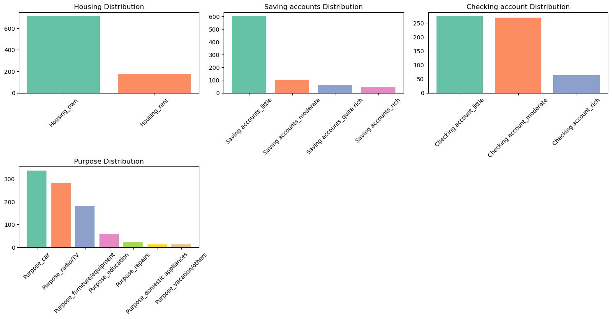
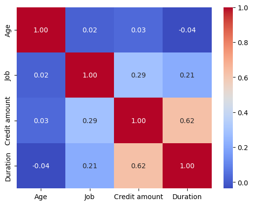
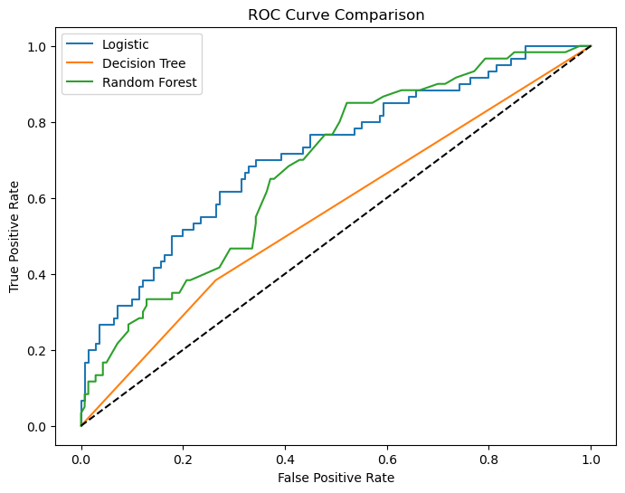
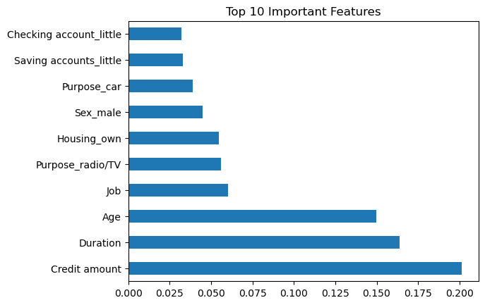

# Credit Risk Modeling Report

## Goal: Assess Creditworthiness of Loan Applicants

The objective of this project is to assess the creditworthiness of loan applicants by predicting whether an applicant represents **Good Risk (0)** or **Bad Risk (1)**.

Accurate credit risk assessment is essential for financial institutions, as incorrectly approving high-risk applicants can result in financial losses. Therefore, this project focuses not only on overall model accuracy but also on effectively identifying high-risk borrowers.

---
# Table of Contents
 
1. [Clear Problem Statement](#1-clear-problem-statement)  
2. [Why Class Imbalance Matters](#2-why-class-imbalance-matters)  
3. [Why SMOTE Was Used](#3-why-smote-was-used)  
4. [Model Comparison](#4-model-comparison)  
5. [ROC Curve Analysis](#5-roc-curve-analysis)  
6. [SHAP Explanation (Model Interpretability)](#6-shap-explanation-model-interpretability)  
7. [Business Interpretation](#7-business-interpretation)  
8. [Limitations](#8-limitations)  
9. [Conclusion](#conclusion)

---
## 1. Clear Problem Statement

This project formulates credit risk evaluation as a **binary classification problem**. Using demographic and financial attributes such as age, job status, credit amount, loan duration, housing type, and account information, the model predicts the probability of default.

The key objectives are:

- Minimize approval of high-risk borrowers  
- Improve reliability of lending decisions  
- Support data-driven credit policy  

Special emphasis is placed on improving **Recall for the Bad Risk class**, as failing to detect high-risk applicants can lead to financial losses.

---

## 2. Why Class Imbalance Matters

The dataset contains:

- 70% Good Risk applicants  
- 30% Bad Risk applicants  

This imbalance creates a modeling challenge. A naive model could achieve high accuracy by predicting most applicants as Good Risk while failing to detect high-risk borrowers.

In credit risk modeling:

- **False Negative (Bad predicted as Good)** → Financial loss  
- **False Positive (Good predicted as Bad)** → Opportunity cost  

Therefore, relying solely on accuracy is misleading. The model must be evaluated using metrics such as **Recall (Bad Risk)** and **ROC-AUC**.

---

## 3. Why SMOTE Was Used

To address class imbalance, **SMOTE (Synthetic Minority Oversampling Technique)** was applied to the training dataset.

Before SMOTE:

- Good Risk: 560  
- Bad Risk: 240  

After SMOTE:

- Good Risk: 560  
- Bad Risk: 560  

SMOTE generates synthetic examples of the minority class instead of duplicating existing samples. This ensures:

- Balanced class distribution  
- Reduced model bias toward majority class  
- Improved sensitivity to high-risk applicants  

SMOTE was applied only on the training data to prevent data leakage.

---

## 4. Model Comparison

Three classification models were evaluated:

- Logistic Regression  
- Decision Tree  
- Random Forest  

| Model               | Accuracy | Recall (Bad Risk) | ROC-AUC |
|--------------------|----------|-------------------|---------|
| Logistic Regression | 71%      | 45%               | 0.72    |
| Decision Tree       | 63%      | 38%               | 0.56    |
| Random Forest       | 68%      | 35%               | 0.68    |

### Observations
- Credit Distribution
- 
- Correlation
- 
- Logistic Regression achieved the highest ROC-AUC (0.72).
- Logistic Regression also had the highest recall for Bad Risk (45%).
- Decision Tree showed weaker discriminatory performance.
- Random Forest performed moderately but did not outperform Logistic Regression.

Based on these results, Logistic Regression is the most suitable model for this dataset.

---

## 5. ROC Curve Analysis

The ROC Curve evaluates the trade-off between:

- True Positive Rate (Recall)  
- False Positive Rate  

The Logistic Regression model achieved the highest ROC-AUC score (0.72), indicating better discrimination between Good and Bad Risk applicants.

A higher ROC-AUC suggests stronger ability to rank high-risk applicants above low-risk ones.

- ()

---

## 6. SHAP Explanation (Model Interpretability)

SHAP (SHapley Additive exPlanations) was used to interpret model predictions.

SHAP provides:

- Global feature importance  
- Direction of feature impact  
- Individual-level explanation  

Key insights from SHAP analysis:

- Longer loan duration increases probability of default.
- Lower checking account balance significantly increases risk.
- Higher credit amount moderately increases default probability.
- Limited savings account availability correlates with higher risk.

SHAP improves model transparency by clearly showing how each feature contributes to risk classification.

- 

---

## 7. Business Interpretation

From a financial institution perspective:

- Applicants with longer loan durations represent higher repayment uncertainty.
- Customers with limited liquidity show elevated default probability.
- Larger credit exposure increases financial vulnerability.
- Most important feature
- 
The model can support:

- Risk-based loan approvals  
- Interest rate adjustments  
- Conservative lending strategies  
- Improved capital allocation  

Although recall remains moderate (45%), the model demonstrates meaningful risk separation and provides a foundation for further optimization.

---

## 8. Limitations

Despite structured modeling, several limitations exist:

1. The dataset size is relatively small (1000 records).
2. Synthetic data generated by SMOTE may not perfectly reflect real borrower behavior.
3. External macroeconomic factors were not included.
4. Recall for Bad Risk remains moderate.
5. Performance may vary on unseen real-world datasets.

### Future Improvements

- Threshold tuning  
- Cost-sensitive learning  
- Additional financial variables  
- Cross-validation  
- Larger external datasets  

---

## Conclusion

This project demonstrates a structured approach to credit risk modeling using imbalance handling, model comparison, and explainable AI techniques. Logistic Regression emerged as the most effective model for this dataset, achieving the highest ROC-AUC and recall for high-risk applicants.

The results provide actionable insights for financial institutions seeking data-driven credit risk assessment.
